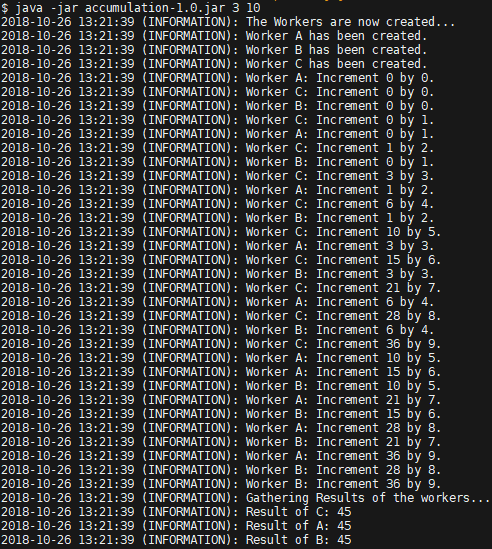

[](https://codein.withgoogle.com/)

This repository is original and follows the
[student terms](https://codein.withgoogle.com/student-terms/).

## Concurrent Accumulation
[](http://www.oracle.com/technetwork/java/javase/downloads/jdk8-downloads-2133151.html)
[](https://google.github.io/styleguide/javaguide.html)


The **Concurrent Accumulation Task** required me to start numerous threads, which
concurrently increments an integer within an endless loop,
by the iterations index. Whereas the integer exists on the threads *stack* and is therefor
not shared across memory while the thread operates upon it. I used some *synchronizers* of the
*Java Concurrency Library* to coordinate the threads and transfer their accumulation result to the *"main"* thread. 
Because of the extensive use of *synchronizers*, which mostly requires to know
the number of worker threads that are currently running, the application requires all threads
to run in one go. *Thread pooling* may be used and can be enabled by adding the `THREAD_POOL` argument. 
By default a new thread is allocated when the accumulation begins, and it terminatess after the 
result has been transferred to the *"main"* thread. 

To run the Solution you just need to build the project by using **gradle**:

``` 
gradle jar
```

and then you can run the generated **jar file**:
```
java -jar accumulation-1.0.jar 3 10
```

This lie will give following output:



Arguments are not required nor do they have to be correct.
If no or invalid arguments are given, the default configuration is used.

If you come across any **issues** while reading, building
or executing the code, just let me know by kindly creating an issue.
